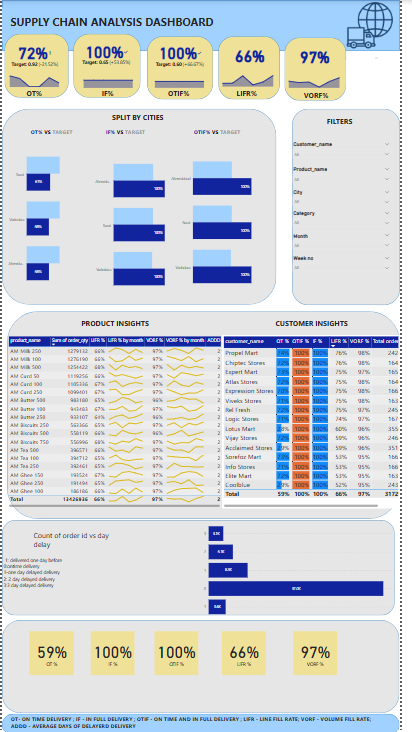

# supply-chain-analysis

# 📦 Supply Chain Analysis Dashboard

This project presents a **Supply Chain Analysis Dashboard** developed for tracking and optimizing logistics and fulfillment performance across various cities, products, and customers.

## 📊 Overview

The dashboard provides a comprehensive view of key supply chain metrics such as:

- **OTIF (On Time In Full)**: Measures deliveries that are on time and complete.
- **IFR (In Full Rate)**: Tracks the percentage of orders delivered in full.
- **OT (On Time Delivery)**: Measures timeliness of order fulfillment.
- **LIFR (Line Fill Rate)**: Tracks the completeness of individual order lines.
- **VOFR (Volume Fill Rate)**: Measures the proportion of volume delivered vs ordered.

## 📍 Key Sections

### 1. **Top Metrics Cards**
- High-level KPIs for OTIF, IFR, OT, LIFR, and VOFR.

### 2. **Split by Cities**
- Compares KPIs (OTIF, IFR, OT) across different cities.

### 3. **Filters Panel**
- Interact with the dashboard using filters such as:
  - `Customer Name`
  - `Product Name`
  - `Category`
  - `Region`
  - `Month`
  - `Week`

### 4. **Product Insights**
- Product-wise breakdown of performance metrics with:
  - Daily and cumulative KPIs
  - Monthly trends for OTIF, IFR, LIFR, VOFR

### 5. **Customer Insights**
- Customer-wise distribution of supply chain metrics for comparison.

### 6. **Delay Analysis**
- Bar chart showing the count of orders by days of delay (0 to >5 days).

## 📌 Key Insights

- Identify underperforming products or customers.
- Track supply chain bottlenecks by geography.
- Evaluate fulfillment trends over time.

## 🛠 Tools Used

- **Power BI** / Excel for visualization (assumed from visual style)

